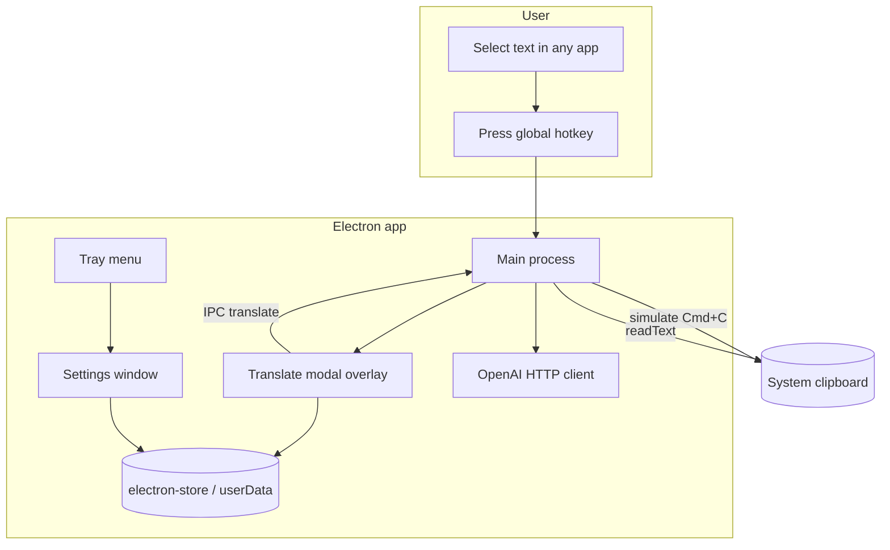

# Design Spec: macOS Translate Hotkey (Electron)

**Status:** Approved for implementation  
**Created:** 2026-05-20  
**Scope:** Dev-only MVP on macOS, no release/notarization

**UI:** shadcn/ui components (`src/renderer/components/ui/`) with Tailwind CSS v4 in `src/renderer/styles/globals.css`. This doc covers behavior, IPC, and data flow only.

---

## Problem

User selects text in any app (chat, browser, native). They need fast translation without leaving context. Chrome-style “bubble on select” is not available cross-app on macOS without Accessibility heuristics.

## User stories

1. As a user, I select text anywhere, press a global hotkey, and see a modal with source text and translation.
2. As a user, I choose source/target languages in the modal; choices persist across app restarts.
3. As a user, I configure hotkey and OpenAI model in a Settings window from the menu bar tray.
4. As a developer, I store `OPENAI_API_KEY` in `.env` (not committed).

## Decisions (locked)

| Topic | Choice |
|-------|--------|
| Text capture | Global hotkey → simulate Cmd+C → read clipboard |
| Clipboard restore | No |
| Translation | OpenAI Chat Completions (prompt translate) |
| API key | `.env` / env at launch |
| Platform | Electron + Node/TypeScript |
| UI v1 | Hotkey → large modal directly (no small chip) |
| Translate timing | Auto on modal open |
| Languages | User picks source/target in modal; persisted in userData |
| App shell | Tray + Settings window; hide Dock when background utility |
| Release | None (local dev) |

## Approaches considered

| # | Approach | Verdict |
|---|----------|---------|
| 1 | Electron monolith (main: hotkey, copy, API; renderer: UI) | **Selected** |
| 2 | Electron + Swift helper for Cmd+C | Rejected (extra codebase) |
| 3 | Native Swift menu bar + Node sidecar | Rejected (conflicts with Node runtime goal) |

## Architecture



### Components

| Component | Responsibility |
|-----------|----------------|
| **Main** | `globalShortcut`, clipboard capture, OpenAI calls, window lifecycle, tray, `app.dock.hide()` |
| **Translate modal** | Frameless, `alwaysOnTop`, shows source + langs + result + loading/error + Retranslate |
| **Settings** | Hotkey binding UI, model name, default langs, link to `.env` for API key |
| **Prefs** | `sourceLang`, `targetLang`, `hotkey`, `openaiModel` in userData |

## Data flow

1. User selects text in foreground app.
2. User presses registered hotkey (e.g. `Cmd+Shift+T`).
3. Main: optional short delay (50–100ms) → simulate `Cmd+C` via `@nut-tree/nut-js` or `robotjs` (fallback: AppleScript `tell application "System Events"`).
4. Main: `clipboard.readText()`; if empty → modal shows error “No text captured”.
5. Main: open/focus modal at cursor screen coords or center of active display; send IPC `{ text, sourceLang, targetLang }`.
6. Renderer: on mount, call `translate` IPC → main calls OpenAI → returns `{ translation, error? }`.
7. User changes language dropdown → clicks **Retranslate** (or auto-debounce v2) → repeat step 6.
8. User closes modal (Esc / click outside / Close).

## IPC contracts

| Channel | Direction | Payload |
|---------|-----------|---------|
| `capture-and-open` | main internal | Triggered by hotkey |
| `translate:request` | renderer → main | `{ text, sourceLang, targetLang, model? }` |
| `translate:response` | main → renderer | `{ translation }` or `{ error: string, code? }` |
| `prefs:get` | renderer → main | — |
| `prefs:set` | renderer → main | `Partial<Prefs>` |
| `prefs:changed` | main → renderer | `Prefs` broadcast |

```ts
type Prefs = {
  sourceLang: string;   // ISO 639-1 e.g. "auto" | "en"
  targetLang: string;   // e.g. "vi"
  hotkey: string;       // Electron accelerator e.g. "Command+Shift+T"
  openaiModel: string;  // e.g. "gpt-4o-mini"
};
```

## OpenAI integration

- **Env:** `OPENAI_API_KEY` (required), optional `OPENAI_MODEL` default in code.
- **Endpoint:** `POST https://api.openai.com/v1/chat/completions`
- **System prompt (fixed):** Translate only; preserve meaning; no commentary; output translation text only.
- **User message:** `Translate from {source} to {target}:\n\n{text}`
- **Limits:** Reject or truncate > ~8k chars with UI message (config constant).
- **Errors:** Map 401/429/5xx to user-facing strings; log details in main only.

## UI spec (modal)

- **Layout:** Source (read-only), language row (source ▼, target ▼), translation area, footer (Close, Retranslate).
- **States:** loading spinner on open; error banner; success text.
- **Window:** `transparent: true`, `frame: false`, `alwaysOnTop: true`, `skipTaskbar: true`, size ~480×560 (resizable). Positioned at the text selection anchor (Accessibility bounds when available, else cursor at hotkey) with a speech-bubble tail pointing at the anchor; flips above/below to stay on screen.

## UI spec (settings)

- Hotkey recorder / text field (validate accelerator).
- OpenAI model dropdown or text input.
- Default source/target languages.
- Note: “API key: set OPENAI_API_KEY in .env”
- Save → `prefs:set` + re-register hotkey in main.

## macOS permissions & setup

Document in README:

- **Accessibility** (if using nut-js/robotjs for synthetic keys): System Settings → Privacy → Accessibility → enable app.
- **Input Monitoring** may be required on newer macOS for global shortcuts in some Electron versions.
- First-run: tray menu “Open Settings” if key missing.

## Error handling

| Case | Behavior |
|------|----------|
| Empty clipboard after copy | Modal: “Select text and try again” |
| OpenAI 401 | “Invalid API key” |
| OpenAI 429 | “Rate limited, retry” |
| Network offline | “Check connection” |
| Hotkey conflict | Settings shows warning on save |
| Text too long | Truncate with warning or block translate |

## Security (dev scope)

- API key never in renderer; only main reads `process.env`.
- `.env` in `.gitignore`; `.env.example` committed.
- No telemetry v1.

## Testing strategy

- Manual: Slack, Safari, Notes, VS Code — select → hotkey → modal → translation.
- Unit (optional v1): prompt builder, lang code validation.
- Mock OpenAI in dev via env flag `MOCK_TRANSLATE=1`.

## Out of scope v1

- Small chip on text selection without hotkey
- Clipboard restore
- Google Translate / Soniox
- On-device models
- App Store / notarization / auto-update
- Multi-monitor polish beyond clamp

## Success criteria

- [ ] Hotkey works from at least 3 app types (browser, chat, editor)
- [ ] Modal opens <500ms after hotkey with captured text
- [ ] Auto-translate returns result or clear error
- [ ] Language prefs persist after quit
- [ ] Tray → Settings opens; Dock hidden in background mode

## Risks

| Risk | Mitigation |
|------|------------|
| Cmd+C fails in some apps | README + Accessibility; optional “paste fallback” in Settings v2 |
| Electron globalShortcut blocked | Document Input Monitoring; test on target macOS version |
| OpenAI cost on accidental hotkey | v2: manual translate toggle; v1 accept for dev |

## Dependencies (npm)

- `electron`, `electron-store`, `openai` (official SDK)
- `@nut-tree/nut-js` or `robotjs` (evaluate arm64 build on Apple Silicon)
- `vite` + `react` or plain HTML (recommend React for modal/settings consistency)
