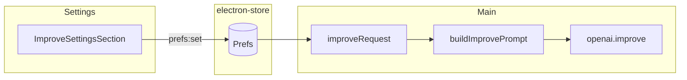

# Improve writing config (vibe + strength)

**Status:** Approved for implementation  
**Created:** 2026-05-21

## Problem

Help me write uses fixed system prompts (`SYSTEM_IMPROVE_SAME` / `SYSTEM_IMPROVE_CROSS` in `openai.ts`). Users cannot control tone (vibe) or how aggressively text is edited (strength). Power users want consistent personal voice; casual users want Professional vs Casual without editing prompts manually.

## User stories

1. As a user, I set a default **vibe** (Neutral / Professional / Casual / Friendly) in Settings so every improve run matches my tone.
2. As a user, I set **edit strength** (Light / Balanced / Strong) so grammar-only vs full rewrite matches my risk tolerance.
3. As a user, I add optional **custom instructions** (short hint) that append to the prompt without replacing safety rules.
4. As a bilingual user, when source ≠ target, improve still **translates into target language** first; vibe/strength only shape the target-language output (not skip translation).
5. As a user, I change improve settings in Settings only; the modal stays focused on text and languages.

## Decisions (locked)

| Topic | Choice |
|--------|--------|
| Vibe model | Curated presets + optional custom add-on (max 200 chars) |
| Extra control | Edit strength: light / balanced / strong |
| Configuration UI | Settings only |
| Cross-language | Always translate to target; vibe + strength apply to output |
| Presets v1 | Neutral, Professional, Casual, Friendly |
| Architecture | Shared prompt builder module (Approach 1) |

## Evaluated approaches

| Approach | Verdict |
|----------|---------|
| Prompt composition module in `src/shared` | **Selected** — testable, provider-agnostic |
| Inline switches only in `openai.ts` | Rejected — unmaintainable when adding providers |
| Full user system prompt | Rejected — conflicts with preset + safety model |

## Architecture



### Components

| Component | Path (proposed) | Role |
|-----------|-----------------|------|
| Types + defaults | `src/shared/types.ts`, `src/shared/improve-config.ts` | `ImproveVibeId`, `ImproveStrengthId`, preset catalog |
| Prompt builder | `src/shared/improve-prompt.ts` | `buildImprovePrompt()` → `{ system, user, sameLang }` |
| Prefs I/O | `src/main/prefs.ts` | Persist + migrate new fields |
| Improve pipeline | `src/main/improve.ts`, `src/main/providers/openai.ts` | Pass prefs into builder |
| Settings UI | `src/renderer/settings/App.tsx` (+ optional `ImproveSettingsSection.tsx`) | Vibe select, strength control, custom hint |

## Data model

```ts
type ImproveVibeId = 'neutral' | 'professional' | 'casual' | 'friendly'
type ImproveStrengthId = 'light' | 'balanced' | 'strong'

// Extends Prefs:
improveVibe: ImproveVibeId           // default: 'neutral'
improveStrength: ImproveStrengthId   // default: 'balanced'
improveCustomHint: string            // default: '', max 200 trimmed
```

`DEFAULT_PREFS` and `getPrefs()` migration: if keys missing, apply defaults (mirror `migrateLegacyPrefs` pattern).

IPC unchanged: `improve:request` still `{ text, sourceLang, targetLang, model? }`. Main reads improve prefs from `getPrefs()` at request time.

## Prompt composition

### Mode detection

`sameLang = sourceLang !== 'auto' && targetLang !== 'auto' && sourceLang === targetLang`

### Base system (mode)

**Same language:** Proofread/rewrite in target language. Output ONLY final text. Preserve meaning. No commentary.

**Cross language:** Translate into target language, then apply style. Output entirely in target language. Preserve meaning. No commentary.

### Layers (append in order)

1. Vibe fragment (from preset)
2. Strength fragment
3. If `customHint` non-empty: `Additional user instructions: {hint}` — must not override output-only / preserve-meaning rules

### Strength fragments

| ID | Instruction summary |
|----|---------------------|
| light | Fix grammar, spelling, punctuation only; minimal rephrase |
| balanced | Improve clarity with light rephrase; keep structure where possible |
| strong | Rewrite for flow and tone while preserving meaning; do not add facts |

### Vibe fragments (v1)

| ID | Instruction summary |
|----|---------------------|
| neutral | Clear, neutral tone |
| professional | Formal, workplace-appropriate |
| casual | Relaxed, conversational |
| friendly | Warm, approachable; not slang-heavy |

### User message (unchanged shape)

- Same: `Proofread in {targetLabel}:\n\n{text}`
- Cross: `Rewrite in {targetLabel} (from {sourceLabel}). The output must be entirely in {targetLabel}:\n\n{text}`

### Model params

Keep `temperature: 0.2` for v1.

## Settings UI

New section **Writing style (Help me write)** in Settings card:

- **Vibe:** `<Select>` — 4 presets; show preset description under control
- **Edit strength:** segmented control or radio group with one-line helper per option
- **Additional instructions:** optional `<Textarea>` or `<Input>`, placeholder example, character counter (200 max)

Save with existing Save button (same `savePrefs.mutate` payload). Validate custom hint length before save; show inline error if over limit.

## Error handling & edge cases

| Case | Behavior |
|------|----------|
| Empty / whitespace custom hint | Treated as empty; omit layer 3 |
| Custom hint > 200 chars | Block save; inline error in Settings |
| Invalid vibe/strength in store (manual edit) | `getPrefs()` coerces to defaults |
| `sourceLang` or `targetLang` is `auto` | Existing resolve logic in `openai.improve`; then `sameLang` false if langs differ after resolve |
| Custom hint prompt injection | Prefix as "user instructions"; base rules require output-only + preserve meaning |
| API errors | Unchanged (`ImproveResponse` error codes) |
| Long text | Unchanged `MAX_TRANSLATE_CHARS` |

## Testing strategy

| Level | What to verify |
|-------|----------------|
| Unit | `buildImprovePrompt` — same vs cross base, each vibe, each strength, custom hint present/absent, unknown ids fallback |
| Unit | Prefs migration defaults for missing keys |
| Manual | Settings save → reopen → values persist |
| Manual | Same-lang EN + Light + Neutral → minimal edits |
| Manual | Cross vi→en + Strong + Casual → Vietnamese input → casual English output |
| Manual | Custom hint "use Oxford comma" respected without breaking output-only rule |

No E2E required for v1 unless project already has Playwright for Electron (it does not).

## Success criteria

- [ ] All four vibes produce noticeably different tone on sample paragraph (manual)
- [ ] Light vs Strong differ in amount of rephrase on same sample
- [ ] Cross-lang still outputs target language only
- [ ] Settings persist across relaunch
- [x] `npm run typecheck` passes
- [x] `npm run test` passes (prompt builder unit tests)

## Risks

| Risk | Mitigation |
|------|------------|
| Model ignores strength | Explicit strength fragment; revisit temperature per strength later |
| Vibe + strength overlap | Keep preset descriptions distinct from strength labels |
| Custom hint abuse | 200 char cap; appended subordinate to base rules |

## Out of scope (v1)

- Modal quick-switch for vibe/strength
- Per-language improve profiles
- Preview button in Settings
- Gemini provider (listed coming soon)
- Length target (shorter/longer) control

## Dependencies

- Existing `Prefs` / `electron-store` / Settings save flow
- OpenAI provider `improve()` only (no translate changes)
