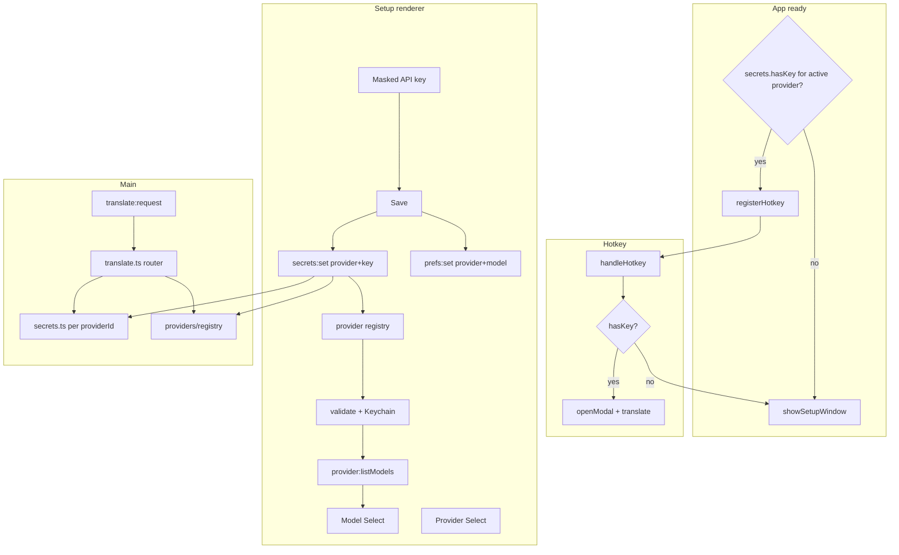

# Design Spec: BYOK API Key + Model Picker + Provider-Ready Setup

**Status:** Implemented — plan at `plans/260521-byok-provider-setup/`  
**Date:** 2026-05-21

## Problem

Users must edit project `.env` / rebuild to set `OPENAI_API_KEY`. Model is free-text with no validation. This blocks distribution (developer key in binary) and causes typo failures.

## User stories

1. As a new user, on first launch I see a setup screen to enter my OpenAI API key and pick a model before using translate.
2. As a user, my API key is stored securely on my Mac (Keychain), not in prefs JSON or `.env`.
3. As a user, I pick a model from a dropdown populated from my account’s available chat models.
4. As a user, Save validates my key immediately and shows clear errors if invalid.
5. As a returning user, I change key/model in Settings; translate uses Keychain key only.
6. As a product owner, the codebase is structured so adding Anthropic/Gemini/etc. later does not rewrite Settings/IPC/secrets.

## Decisions (locked)

| Topic | Choice |
|--------|--------|
| Key storage | macOS Keychain via Electron `safeStorage` |
| Key at translate | User Keychain only — **no** `.env` fallback |
| Model list | Live `GET /v1/models`, client-side chat filter |
| Key validation | On Save → store → fetch models |
| First run | **Launch gate (A):** Setup window if no key; hotkey blocked until configured |
| Multi-provider | Provider-ready architecture; v1 ships OpenAI only |
| Provider UI | **Select shows OpenAI + Gemini; only OpenAI `enabled`** |

## Approach

**Main-process secrets + provider registry + IPC.** v1 implements one provider (`openai`). Translate/list/validate route through a shared interface so new providers are new files + registry entry, not a rewrite of Settings.

### Provider-ready shape (v1 = OpenAI only)

```ts
// src/shared/providers.ts
export const PROVIDERS = [
  { id: 'openai', label: 'OpenAI', enabled: true },
  { id: 'gemini', label: 'Google Gemini', enabled: false }
] as const

export type ProviderId = (typeof PROVIDERS)[number]['id']

export type TranslationProvider = {
  id: ProviderId
  validateApiKey(apiKey: string): Promise<void>
  listChatModels(apiKey: string): Promise<ModelOption[]>
  translate(params: TranslateParams): Promise<TranslateResponse>
}
```

| Layer | v1 | Later |
|-------|----|-------|
| `src/main/providers/registry.ts` | Map `openai` → OpenAI adapter | Add `anthropic`, etc. |
| `src/main/providers/openai.ts` | Move logic from `openai.ts` | Unchanged contract |
| `src/main/translate.ts` | `getProvider(prefs.provider)` → translate | Same router |
| `src/main/secrets.ts` | Keys namespaced by `providerId` | Per-provider key blob |
| Prefs | `provider: 'openai'`, `model: string` | User switches provider in UI |
| IPC | `secrets:*`, `provider:listModels` (not `openai:*`) | Same IPC, different adapter |
| UI | Provider `<Select>`: OpenAI + Gemini listed; Gemini disabled | Set `enabled: true` + add adapter |

**Prefs migration:** rename `openaiModel` → `model`; on load, if legacy `openaiModel` exists, copy to `model` and set `provider: 'openai'`.

**Gate condition:** `isConfigured()` = has Keychain key for **active** `prefs.provider` (v1 always `openai`).

## Architecture



### New / changed files

| Path | Role |
|------|------|
| `src/shared/providers.ts` | `ProviderId`, `PROVIDERS` catalog, shared types |
| `src/main/secrets.ts` | `hasApiKey(provider)`, `setApiKey(provider, key)`, etc. |
| `src/main/providers/openai.ts` | OpenAI validate / list / translate |
| `src/main/providers/registry.ts` | `getProvider(id)` |
| `src/main/translate.ts` | Resolve prefs → provider → translate |
| `src/main/windows.ts` | `createSetupWindow`, `showSetupWindow`; gate `showSettingsWindow` optional same size |
| `src/main/index.ts` | Startup gate; hotkey guard; IPC handlers |
| `src/renderer/setup/` | First-run + re-entry when key missing (new Vite entry) |
| `src/renderer/settings/App.tsx` | Key management + model Select (shared components with setup) |
| `src/shared/electron-api.ts` | New IPC types |
| `electron.vite.config.ts` | Add `setup` renderer input |

### Window behavior

- **Setup window:** Shown on `app.whenReady` if `!hasApiKey()`. Non-closable until success OR user quits app (no “Skip”). Tray menu: “Configure API Key…” opens Setup if missing, else Settings.
- **Hotkey:** Registered always, but handler checks `hasApiKey()` first → `showSetupWindow()` instead of `openModal`.
- **After successful Setup Save:** Close Setup (if open), ensure hotkey registered, optionally show brief success; do not auto-open modal.
- **Settings:** Full prefs (hotkey, languages, key change, model). Accessible anytime from tray.

### Prefs vs secrets

- `electron-store`: `hotkey`, `sourceLang`, `targetLang`, `provider` (`'openai'`), `model` (string id)
- Keychain: one encrypted key per `providerId` (v1 only `openai` slot used)

### Deprecations

- `OPENAI_API_KEY` / `OPENAI_MODEL` no longer used for translate/model resolution
- Remove `warnIfMissingApiKey` env check; replace with Keychain check
- README: remove “embed `.env` at build” for API key; document Setup + Keychain
- Packaged `.env` for secrets: optional removal from build pipeline (non-secret vars only if needed later)

## Data flow & IPC contracts

### `secrets:hasKey` → `boolean`

```ts
{ provider?: ProviderId } // default: active prefs.provider
```

Used by Setup/Settings on load and main startup gate.

### `secrets:set` → `SecretsSetResult`

```ts
type SecretsSetRequest = { provider: ProviderId; apiKey: string }

type SecretsSetResult =
  | { ok: true }
  | { ok: false; error: string; code?: 'invalid_key' | 'network' | 'encryption_unavailable' }
```

**Flow:**

1. Trim key; reject empty.
2. `getProvider(provider).validateApiKey(apiKey)` (OpenAI: `models.list({ limit: 1 })`).
3. On 401 → `{ ok: false, code: 'invalid_key', error: 'Invalid API key.' }` — **do not** persist.
4. On success → `safeStorage.encryptString(key)` → persist blob (see storage format below).
5. Never return key bytes to renderer after success.

### `secrets:clear` → `{ ok: true }`

```ts
{ provider?: ProviderId }
```

Clears Keychain entry for that provider. After clear, next launch shows Setup; hotkey routes to Setup.

### `provider:listModels` → `ListModelsResult`

```ts
{ provider?: ProviderId }
```

```ts
type ModelOption = { id: string; label?: string }

type ListModelsResult =
  | { ok: true; models: ModelOption[] }
  | { ok: false; error: string; code?: 'missing_key' | 'invalid_key' | 'network' }
```

**Requires** stored key for provider. Delegates to `getProvider(provider).listChatModels(apiKey)`.

**Chat filter heuristic (v1):**

- Include: ids matching `/^(gpt-|o\d|chatgpt-)/i` and not matching embedding/tts/whisper/dall-e/realtime/transcribe
- Sort: `gpt-4o-mini`, `gpt-4o` first, then alphabetical
- If saved `openaiModel` not in list (deprecated), still show saved value at top of Select

### Existing (unchanged shape)

- `prefs:get` / `prefs:set` — add no key fields
- `translate:request` — uses active `prefs.provider` + Keychain key + `prefs.model`

### Keychain storage format

- File `userData/secrets.json`: `{ [providerId: string]: encryptedBase64 }` e.g. `{ "openai": "..." }`
- Value: `safeStorage.encryptString(apiKey)` as base64 or Buffer in a small JSON file in `userData` **or** use electron-store with single encrypted field — prefer dedicated file `secrets.json` with `{ encrypted: string }` to avoid mixing with prefs export
- If `!safeStorage.isEncryptionAvailable()`: return `encryption_unavailable` with message to check macOS login keychain

## UI spec

### Setup screen (`src/renderer/setup/App.tsx`)

- Card layout consistent with Settings (shadcn)
- **Provider** `<Select>`: options from `PROVIDERS`; render Gemini disabled with “Coming soon” (or `disabled` on `SelectItem`); default `openai`
- Title: “Connect your AI provider” (subtitle shows provider name)
- Copy: key stored in macOS Keychain, sent only to the selected provider’s API
- Masked `Input` type password
- `Select` for model — disabled until first successful key save OR loaded in same Save handler sequence
- Primary **Save & Continue** → `secrets:set({ provider, apiKey })` → on success `provider:listModels` → default `gpt-4o-mini` if present else first → `prefs:set({ provider, model })` → close window
- Loading state on button during validate+list
- Destructive `Alert` on error

### Settings (existing window)

- Provider `<Select>` (same catalog; Gemini disabled)
- Replace model `Input` with `Select` + refresh on open when `hasKey` for active provider
- API key section:
  - If `hasKey`: “API key configured” + **Change key** (reveals password field) + **Remove key**
  - If `!hasKey`: link/button “Open setup” or inline same fields as Setup
- Remove `.env` instruction paragraph
- Save prefs: hotkey/languages/model; key change uses `secrets:set` when field non-empty

### Shared hook (optional)

`useProviderModels(provider)` — TanStack Query `['provider', provider, 'models']`, enabled when `hasKey(provider)`

## Error handling

| Scenario | Behavior |
|----------|----------|
| No key, hotkey | Open Setup, no modal |
| No key, translate IPC | `{ error: 'Add your API key in Settings.', code: 'missing_key' }` |
| User selects disabled provider (Gemini) | Cannot select in UI (`SelectItem disabled`); if prefs tampered, Save/translate returns `provider_not_available` |
| Switch provider in Settings (future) | Clear model list cache; require key for new provider or prompt Setup |
| Invalid key on Save | Alert, no store |
| 429 on validate/list | Retry message |
| Network offline | Clear network error on Save and list |
| `safeStorage` unavailable | Block store; show macOS Keychain guidance |
| Model list empty after filter | Allow Save with last known default `gpt-4o-mini`; show warning |
| Saved model id missing from API list | Keep in Select as disabled option or sticky top item |

## Testing strategy

| Level | Cases |
|-------|--------|
| Unit | Chat model filter function (ids in/out) |
| Unit | `resolveApiKey` returns null when no blob |
| Manual | Fresh install → Setup on launch |
| Manual | Save invalid key → error, no translate |
| Manual | Save valid → hotkey opens modal + translate works |
| Manual | Remove key → Setup on next hotkey / relaunch |
| Manual | Settings change model → retranslate uses new model |
| Manual | Settings change key → old key invalid, new works |

## Implementation risks

- `safeStorage` on unsigned dev builds: test early on local `npm run dev`
- Setup + Settings duplicate UI: extract `ProviderConnectionCard` (provider + key + model)
- Renaming `openaiModel` → `model`: one-time migration in `getPrefs()`
- First launch before Accessibility granted: Setup still works; hotkey capture unchanged

## Success metrics

- Packaged `.app` runs without project `.env` API key
- Zero plaintext API key in `electron-store` or logs
- Model dropdown shows ≥1 model after valid Save
- New user completes Setup in one Save action

## Out of scope (v1)

- Gemini (and other) provider **implementation** — listed in UI only
- Anthropic, local Ollama, etc.
- Custom model ID text field (approach C)
- `.env` fallback for developers
- Key rotation / org billing UI
- Provider-specific options (base URL, Azure deployment, org id)

## Adding a provider later (checklist)

1. Add `{ id, label, enabled: true }` to `PROVIDERS`
2. Implement `TranslationProvider` in `src/main/providers/<id>.ts`
3. Register in `registry.ts`
4. Optional: provider-specific model filter / validate endpoint
5. No IPC renames; Settings/provider card already generic

## Provider catalog (v1 UI)

| id | label | enabled | Notes |
|----|-------|---------|-------|
| `openai` | OpenAI | yes | Full adapter |
| `gemini` | Google Gemini | no | Visible in Select, disabled + “Coming soon” |

Renderer imports `PROVIDERS` from `@shared/providers` for labels/disabled state. Main registry returns error if `!provider.enabled` on set/translate/list.

## Next steps

1. User approves this spec
2. Run `/plan` with `docs/specs/byok-api-key-model-picker.md`
